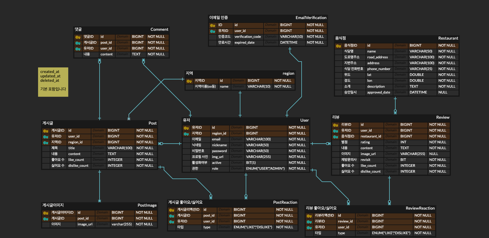

# 맞(맛)집의 고향, 맞고

### ✨전주 맛집 탐방✨

[wiki](https://github.com/kingseungil/matgo/wiki) |
[API 문서]()

[전주시 음식점 공공데이터](https://www.data.go.kr/tcs/dss/selectFileDataDetailView.do?publicDataPk=15076735#tab-layer-openapi)를
이용한 맛집 커뮤니티 서비스입니다.

전주시에 사는 회원님들은 커뮤니티 기능을 이용해서 맛집을 공유하고 리뷰를 남길 수 있습니다.

현지인들이 검증한 맛집을 찾아보세요!

## 프로젝트 기능 및 설계

- [회원 기능]
    - 회원가입: `이메일(unique)`, `비밀번호`, `닉네임(unique)`, `프로필 사진`, `지역`
        - 이메일 인증 (이메일 인증을 하지 않으면 로그인 불가, 24시간 이내에 인증을 하지 않으면 회원가입 정보 삭제)
        - 비밀번호 암호화
        - 닉네임 중복 확인
        - 프로필 사진은 기본 이미지 제공
        - 회원가입 시, 기본적으로 사용자 권한 부여 (관리자는 별도로 생성)
    - 로그인: `이메일`, `비밀번호`
        - 로그인 시, JWT 토큰 발급 (Access Token, Refresh Token)
        - Access Token은 30분, Refresh Token은 7일로 설정
        - Refresh Token은 Redis에 저장
    - 로그아웃: Access Token, Refresh Token 둘 다 만료
    - 회원 정보 수정: `비밀번호`, `닉네임`, `프로필 사진`, `주소`
        - 비밀번호 변경 시, 이전 비밀번호 확인
    - 비밀번호 찾기: 가입한 이메일로 임시 비밀번호 발급 (DB에 저장된 비밀번호도 임시 비밀번호로 변경)
    - 내 정보 조회: 닉네임, 프로필 사진
        - 작성한 리뷰, 좋아요한 리뷰, 작성한 게시글, 좋아요한 게시글, 작성한 댓글 조회 가능 (페이징)
    - 회원 탈퇴: 회원 정보 삭제 (sofe delete)

- [맛집 데이터 관리]
    - OpenAPI에서 데이터를 받아와 RDB(MySQL)에 저장 후, 애플리케이션 레이어에서 MySQL과 Elasticsearch 사이의 실시간 동기화를 수행
        - @Document 어노테이션을 통해 Elasticsearch에 매핑
        - @Entity 어노테이션으로 MySQL 테이블도 매핑
        - 리뷰 별점 데이터가 변경될 때, 해당 식당의 모든 리뷰를 기반으로 별점을 재계산하고 그 결과를 바로 Elasticsearch에 업데이트하여 실시간 동기화를 유지 (별점 순으로 조회하기 위함)
        - 리뷰가 추가/삭제될 때, 해당 식당의 리뷰 개수를 재계산하고 그 결과를 바로 Elasticsearch에 업데이트하여 실시간 동기화를 유지 (리뷰 개수 순으로 조회하기 위함)
        - 주기적인 동기화는 애플리케이션 레이어에서 스케줄링하여 처리
            - MySQL에 저장된 맛집 테이블의 `updated_at` 컬럼을 기준으로 현재 시간에서 1시간 이내에 변경된 데이터만 Elasticsearch에 동기화

- [맛집 조회]
    - 전체 맛집 조회 (페이징)
    - 전주의 `xx동`을 기준으로 맛집 조회 (페이징)
    - 내 주변 맛집 조회 (페이징)
        - 가입 시 입력한 주소를 기준으로 맛집 조회 (`xx동`)
    - 각 조회 시 별점 순, 리뷰 개수 순으로 정렬 가능
    - 맛집 상세 조회
    - 이름으로 맛집 검색

- [맛집 등록 요청]
    - 공공데이터에 존재하지 않는 매장이 있다면, 사용자가 직접 맛집 등록 요청 가능
        - 등록 요청 시, 관리자가 확인 후 승인일시 컬럼에 날짜를 기록 (승인 전까지는 조회 불가능)

- [맛집 리뷰 기능]
    - 리뷰 작성: `별점`, `내용`, `사진`, `재방문 여부`
    - 리뷰 삭제: 리뷰 작성자와 관리자만 가능
    - 리뷰 수정: 불가능
    - 리뷰 상세 조회: 모두 가능
    - 매장 별 리뷰 목록 조회 : 모두 가능
        - 별점 순, 최신 순, 좋아요 순으로 정렬 가능
    - 좋아요/싫어요 기능
        - 회원 당 하나의 리뷰에 한번만 가능

- [커뮤니티]
    - 지역별(`xx동`)로 게시글 작성 가능
    - [게시글]
        - 글 작성,수정: `제목`, `내용`, `사진`, `지역` (사진은 최대 3장)
        - 글 삭제: 글 작성자만 가능
        - 글 조회: 자신의 지역 글만 조회 가능 (페이징)
            - 비회원은 조회 불가능
        - 좋아요/싫어요 기능
            - 회원 당 하나의 게시글에 한번만 가능
    - [댓글]
        - 댓글 작성,수정,삭제: 댓글 작성자만 가능

### 추가 구현 예정

- OAuth 로그인
- 맛집이나 지역을 구독하여 새로운 리뷰나 정보를 알림으로 받을 수 있는 기능
- 맛집 예약서비스

## ERD

## Tech Stack

### Back-end

### Infra

> \[!NOTE]
>
> 아직 배포를 어떻게 할지 정하지 않았습니다.
>
> 추후에 정해지면 업데이트하겠습니다.
